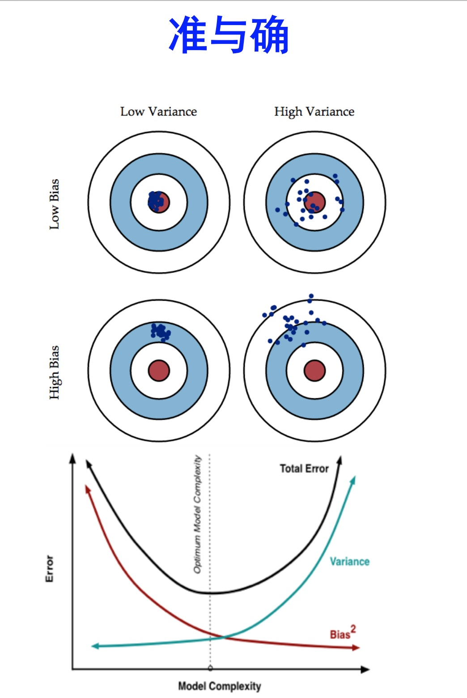

如图所示，这里有一个扔飞镖的图片，很容易从中理解初高中物理实验中偏差和方差的含义。

在初中物理课上，比如用尺子测量一个物体的长度，会遇到两种误差：

1. 由于某种原因（比如尺子受热膨胀），导致测量总是比真实长度短一些。这种是bias（偏差）。
2. 由于使用的是普通文具尺而不是游标卡尺，导致每次测量结果都不太一样，精度很差。这种是 variance（方差）。

前者是 bias，后者是 variance。这其实是一系列测量值和真实值的比较得出来的。

但机器学习中的 bias 和 variance 这两个概念，与这种初中物理中的 bias 和 variance 是如何对应的？

**首先，bias 和 variance 是针对某架构、某模型、某学习方法而言的，而不是针对某一个已经训练好的具体模型。** 

换句话说，不能说某个参数已经训练好的模型的bias或variance，要说一个架构、一个算法的bias或variance.

**Bias 是 “用所有可能的训练数据集训练出的所有模型的输出的平均值” 与 “真实模型”的输出值之间的差异。**

**Variance 是 “不同训练数据集训练出的模型的输出值之间的差异”。**

这里，**真实模型**是假想的理想化正确的模型。**所有可能的训练数据集**指“所有可能的数据”，比如所有可能存在的猫的图片、所有可能存在的手写数字。这两个概念都是理想化的概念。

## 先理解 Variance
Variance 即不同训练数据集训练出的模型之间的差异。比如数据拟合任务中，多次用不同的训练集对 (x, y) 散点进行多项式拟合。
考虑一个最简单的模型：常量模型 y = C，不管训练集怎么变，训练出来的模型都是一样的，这种情况下Variance = 0。
但如果用一个复杂的模型（比如高次多项式），不同训练集很容易训练出差异很大的模型，也就是Variance很高。

## 再理解 Bias
Bias 是所有可能的训练数据集训练出来的所有模型的输出的平均值和真实模型的输出值之间的差异。也可以理解为：用“所有可能的数据”训练出来的模型和真实模型之间的差异。显然，在多项式拟合任务中，简单的模型（如 y = C 或线性模型）训练出来的结果与真实模型有较大差异(bias)，而高次多项式拟合出的的和真实模型的差异(bias)会更小，无穷次多项式时差异(bias)为 0。

## 归纳偏置 inductive bias?

那么 inductive bias 的含义也就更清楚了。显然，简单模型的 bias 会更高。至于为什么叫“inductive”是未知的。

## 总结

所以，

“一个模型的 bias 很高”是指，比如用线性模型拟合散点数据，每次都会拟合错误，而且错误的方向一致（比如每次都把多项式拟合成线性）；或者说给它所有可能的数据，总会拟合成一个与真实函数不同的线性函数。
如果模型的 inductive bias 本身和真实模型一致，比如真实模型就是线性的，那么这就是个很好的模型（当然这种情况就没有 bias 了）。

“一个模型的 Variance 很高”是指，使用不同的训练数据会产生差异很大的模型。比如不同训练集训练出来的高次多项式拟合模型之间的差异要比用线性模型的更大。

所以，开头图中，简单模型对应更小的 variance，复杂模型对应更大的 variance，这样也就容易理解了。

<h3>参考链接</h3>
<ol>
  <li>
    马同学. 
    <a href="https://www.zhihu.com/question/27068705/answer/1689740820" target="_blank">
      机器学习中的 Bias（偏差）、Error（误差）、Variance（方差）有什么区别和联系？ - 知乎
    </a>
  </li>
  <li>
    J JR.
    <a href="https://www.zhihu.com/question/27068705/answer/82132134" target="_blank">
      机器学习中的 Bias（偏差）、Error（误差）、Variance（方差）有什么区别和联系？ - 知乎
    </a>
  </li>
</ol>
